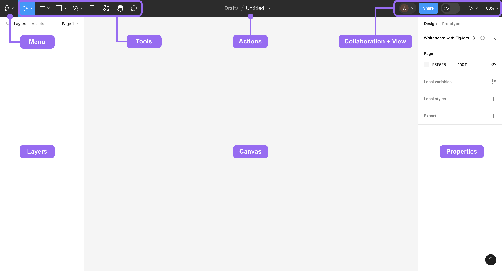
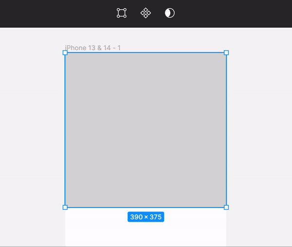
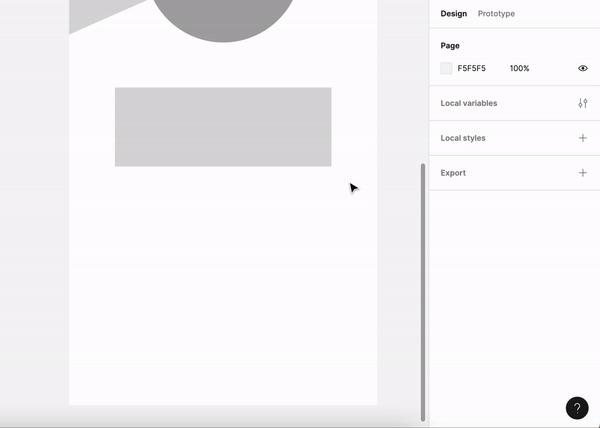
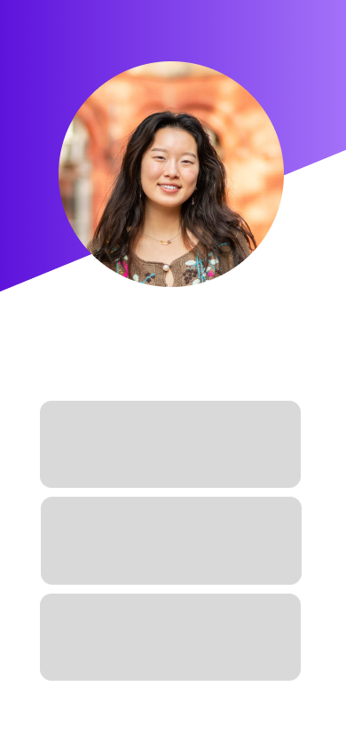
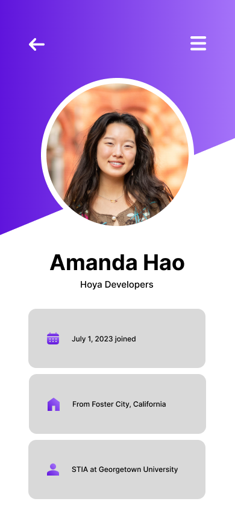
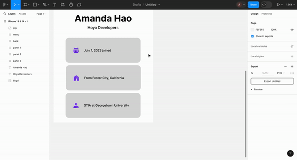
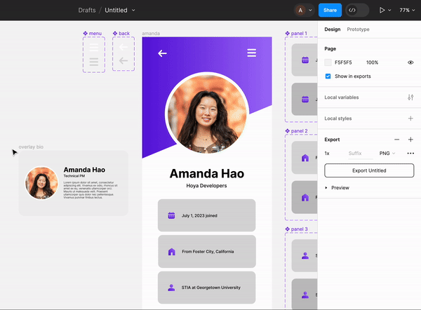
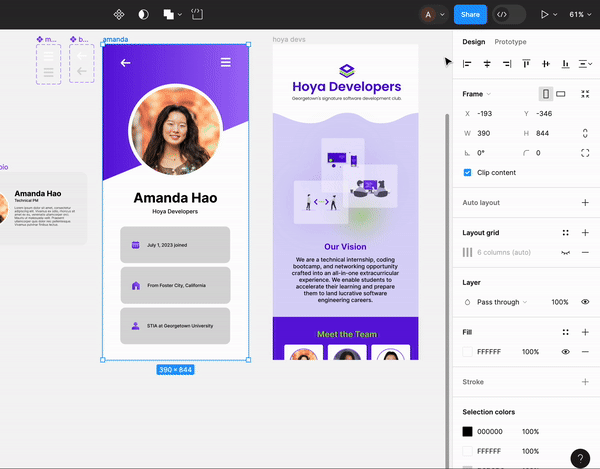

## 2.1 Figma Fundamentals

#### [Class Slides](https://docs.google.com/presentation/d/1rTd0wjK8StV_5h60NiFQkkzvBoQ7m6asS5jQnflITng/edit?usp=sharing)

### Figma Setup

#### What is Figma?

Figma is a design prototyping tool that lets you drag and drop shapes, images, etc. to get a better idea of what you want to eventually code.
Think of it as a cross between powerpoint and photoshop tailored to developing websites and apps.

#### Set up Figma

1. Create a Figma account using your personal email by [clicking here](https://www.figma.com/signup) if you don't already have an account.
2. Verify your new account as an education account by [clicking here](https://www.figma.com/education/).
3. Install Figma for Desktop by [clicking here](https://www.figma.com/downloads/). Once downloaded, follow the installation instructions provided.

### Figma UI

Here's the first thing you see when you create a new design file in Figma.

The following make up the basic interface of the platform.

- **Menu:** Figma's menu can be accessed by clicking their logo located at the top-left corner of the screen. Take a moment to explore the options within this dropdown menu!
- **Tools:** Here you can quickly access the tools you’re likely to use most often: move, frame, shapes, pen, text, etc.
- **Actions:** This area shows extra options for selected objects on the canvas. When no object is selected, Figma displays the file name.
- **Collaboration + View:** The top-right shows sharing functions and real-time viewers of your file.
- **Layers:** The left sidebar lists every element on the page.
- **Canvas:** This is where all objects you create will show up!
- **Properties:** The right panel displays information and settings for selected objects, and is also where you can begin prototyping your object.

### Tutorial

Today, we'll make a simple profile page to show the basics of Figma! Below is a gif representing what we'll create.

#### Setting up

Once you create a new design file, either from Figma's home page or the Menu button, let's start setting up our project.

First, create a frame by selecting the icon in the tool bar (or alternatively, press `F`). In the Properties panel on the right, you should see some of Figma's preset Frame sizes. Let's choose iPhone 13 & 14 for this exercise, but any mobile screen should do.

Frames are essentially a container for otther elements. You should now see a screen appear on your canvas, and on the left, your frame should also be listed on the layers panel.

#### Creating Elements

Let's create some elements. Press `R` to select the rectangle tool (or the shape icon in the tool bar) and drag a rectangle along the dimensions of the frame.

To create a slanted bottom edge for the rectangle we just created, find the Actions toolbar at the top-middle. Select the 'Edit Object' tool on the left, then drag the lower-right corner up to create a trapezoid.

Next, we'll add an ellipse by pressing `O`. Hold `Shift` to create a circle and add that to your frame. You can change the color of this circle to differentiate it from the rectangle we just made, but we'll replace this with a picture of yourself soon! If you experience any layer arrangement issues, you can drag objects to the top or bottom on the Layers sidebar.

Let's add three panels to the lower half of our frame. Again, press `R` to create a rectangle; but let's round the corners of the rectangle to add some extra flair! You can either drag the circle that appears on each corner of the rectangle, or change the radius in the design panel on right. We can copy our first panel two times below.

_Tip:_ Click on an object and hold `Option` to quickly copy elements.

Before we start adding text, let's add in our headshot and a pretty background! Click on the ellipse you made previously and click on 'Fill' on the right Properties panel. There should be four icons: Color, Gradient, Image, and Video. From there, you should be able to upload your headshot and adjust the image accordingly.

Do the same for the asymmetrical rectangle we created. There are other ways to import images into Figma, like using a [clipping mask](https://help.figma.com/hc/en-us/articles/360040450253-Masks) similar to Adobe Illustrator, but this is the easiest way for our purposes.

If you followed along until this point, your frame should look something like this:

#### Plugins

Plugins are powerful tools offered by Figma that extends the functionality of their editor. Click the Resources icon in the Toolbar, then 'Plugins'. From there, download Iconify or any other icon library of your choice. Let's import five icons: home, person, calendar, arrow, and menu. Choose the icon style you prefer best and drag and drop them into your canvas.

Once you have all the icons on your canvas, drag the arrow icon to the top left and menu to the top right. The three rectangles should then have the calendar, home, and person icons (in that order) on the left side of the rectangle.

You can change the color of these icons to make it pop on your page as well :)

#### Text

Time to add text! Press `T` to create a text box on the screen. Type your name and a subheading into two different text boxes; in my case, I wrote my name, then "Hoya Developers". Play around with font family, style, and size until you find something you like.

Next, I added text to the three panels. You can choose to add any information you want, but I added my organization join date, hometown, and school year.

Now, we have a pretty fleshed out design! Your screen should look something like the picture below.

You can also preview your design in Figma's presenter view on the top right to see what it looks like on a device. The design looks fine, but everything on the screen is static — let's add some responsive variants to change that!

#### Components & Prototyping

Let's have the panels change color when hovered over. First, make sure that all elements on each panel are grouped together (the icon, text, and rectangle). Then, select the panel grouping and click the 'Create Component' icon in the toolbar (leftmost icon out of three). Click the same button again to 'Add Variant'. This allows you to experiment with prototypes and variability in your design.

You should now see double of your component. Drag both of them out of your initial frame, as it is no longer something that belonds on your frame. Now, we can change what our variant is. Usually on websites, elements change once we hover on it; let's implement that for our design.

In our variant box, click on the second box (Variant 2) and change the color of the panel to a darker gray. We want the darker panel to appear while hovering!

Now, let's go to the Assets tab in the Layers panel. The panel you just created should now appear as a local component. Drag it out to its original place on the frame. Let's add some interactivity! Select the asset you just added into the frame and click on the Prototype tab on the right. Add an interaction, change 'On Tap' to 'While Hovering' and 'None' to 'Change To'. Next, set Property 1 to 'Variant 2'. Let's also change the transition from 'Instant' to 'Dissolve' so it doesn't look too clunky. Repeat these steps for the second two panels as well. You can also do the same for the Menu and Back buttons!

Let's experiment more with prototyping. Create a rectangle anywhere on the screen for our overlay. You can add a small headshot, heading, subheading, and short biography here. Once you have all of that, group it together and make it a component (no need to add a variant). We want the overlay to appear when we click on our headshot on the initial frame, so let's also make the headshot a component.

Again, go to the Prototype tab on the right. Add an interaction, keeping the 'On Tap' action. This time, change 'None' to 'Open Overlay', then select your overlay object (whatever you named your group selection in the Layers panel). Make the transition 'Dissolve' and make sure 'Close when clicking outside' and 'Add background' are checked in the Overlay settings.

You can preview your design again and try clicking around your interactive elements for some fun!

#### Final Product

Here's the [Figma link](https://www.figma.com/file/nk1imesZnH7m2yG5Lx9TRw/hoya-devs-demo?type=design&node-id=0%3A1&mode=design&t=kboedldsCwkRf7O5-1) to the completed demo. Some things you can try out on your own can be to...

- Create a new frame next to your initial frame and link the two together (check out the Prototype tab and drag objects on different frames).
- Use the Pen tool to create cool graphics (similar to Bézier curves on Adobe Illustrator).
- Explore different plugins and their functionality.

### Figma Dev Mode

Figma recently launched their Dev Mode in Beta which allows you to translate designs into code, faster. It works in tandem with plugins, like Anima, to generate code for languages like React, Vue, HTML, among others.

While it won't give you perfect code, it can provide a good skeleton for starting out projects.

### Conclusion

Now you should be familiar with some of the Figma tools to help you with app development! Any other features you'd like to implement in your design can be easily found online as well.
