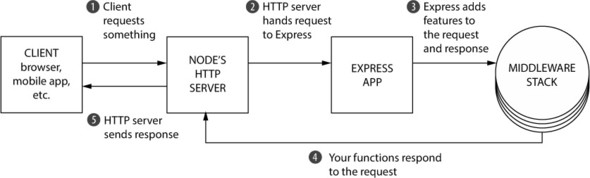
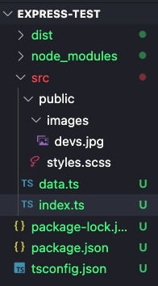
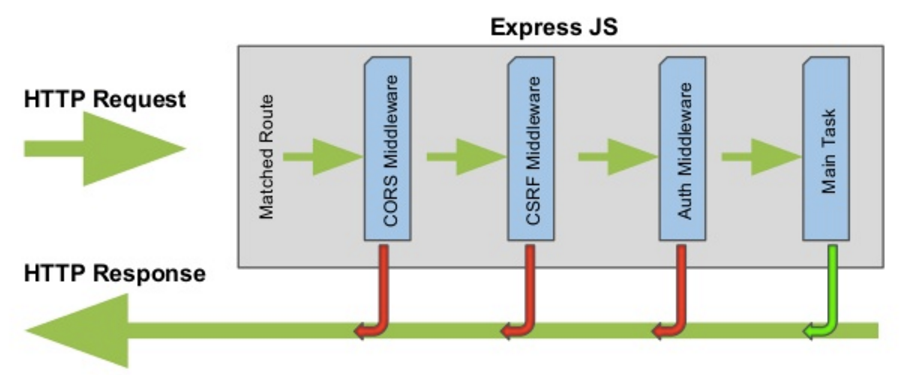

# Node and Express

## Node

Node.JS is a JS runtime environment which allows you to execute JS/TS outside of a broswer. It has an HTTP server which can make requests.

It's event-driven, so events (requests) trigger callback functions. It is often paired with Express.

Here's a digram of how it is architected.


There are some common, built in modules which will often come in handy.

### File System

fs is used to read files.

```
import 'fs';

// Reading a file
fs.readFile('file.txt', 'utf8', (err, data) => {
  if (err) throw err;
  console.log(data);
});
```

### HTTP

```
import 'http';

// Creating an HTTP server
const server = http.createServer((req, res) => {
  res.writeHead(200, { 'Content-Type': 'text/plain' });
  res.end('Hello, Node.js!');
});

// Listening on a port
server.listen(3000, () => {
  console.log('Server listening on port 3000');
});

```

### Path

Used to work with file paths.

```
const path = require('path');

// Joining path segments
const fullPath = path.join(__dirname, 'folder', 'file.txt');
console.log(fullPath);

// Resolving a relative path
const absolutePath = path.resolve('folder', 'file.txt');
console.log(absolutePath);
```

[If you'd like the full list, you can check out the docs here.](https://nodejs.org/api/all.html)

## Express

Express is almost always paired with a Node server. When requests are made to the Node HTTP server, it passes them to the express server, which runs middleware then fulfills the request and provides a response to the Node server, which passes the response back to the client.

You can add express to your project with

`npm install express`

`npm install -D @types/express`



### What it does it do?

Express is a framework built on JS which is used to create quick, easy web applications at scale. It typically is composed of routes, controllers, and views.

A route associates an HTTP verb (GET, POST, UPDATE, DELETE) with a URL path and a function. It refers to how an application's endpoints respond to client requests.

A controller function handles the logic involved with specific routes.

A view is typically composed of HTML, and uses templating engines like EJS.

### Routes

To explain routes, we need to explain HTTP verbs first. The main ones are

POST - creates something

PUT - updates something

GET - reads something

DELETE - deletes something.

I've included some commented out routes in the `testIndex.ts` file. The express app must be created in your `index.ts` file, as that is the entry point for the application.

GET request

```
const app = express();
app.use(express.json()); //middleware

// GET request
// curl -X GET http://localhost:3000
app.get("/", (_, res: Response) => {
  // Handle GET request logic here
  res.send("GET request received");
});
```

POST request

```
// POST request
// curl -X POST http://localhost:3000
app.post("/", (_, res: Response) => {
  res.send("POST request received");
});
```

Another POST, on a different route

```
// POST request
// curl -X POST http://localhost:3000/test
app.post("/test", (_, res: Response) => {
  res.status(200).json({
    firstName: "foo",
    lastName: "bar",
  });
});
```

PUT and DELETE using dynamic route

```
// PUT request
// curl -X PUT http://localhost:3000/123
app.put("/:id", (req: Request, res: Response) => {
  const userId = req.params.id;
  res.send(`PUT request received for user with ID ${userId}`);
});

// DELETE request
// curl -X PUT http://localhost:3000/456
app.delete("/:id", (req: Request, res: Response) => {
  const userId = req.params.id;
  res.send(`DELETE request received for user with ID ${userId}`);
});
```

To serve static files, use the following syntax. Here's an example of a folder structure where you can serve src/public/...



```
// Serving static files at localhost:3000/images/devs.jpg
app.use(express.static(path.join(__dirname, "../src/public")));
```

Finally, make sure the express app is listening on a certain port

```
const port = 3000;
app.listen(port, () => {
  console.log(`Server is running on port ${port}`);
});
```

### curl and Postman

Aside from the browser, the 2 main ways to check if your API is working are by using curl and Postman.

Postman is very cool because it allows you to mock up JWT, cookies, data payloads, etc. All with a GUI. For testing any authentication logic I've written (not just using Firebase), I go with Postman every time.

[Get Postman here.](https://www.postman.com/downloads/)

curl is a bash command which stands for client URL, and allows you to test data transfers to and from servers.

[Here's a curl overview.](https://www.hostinger.com/tutorials/curl-command-with-examples-linux/)

### Response codes

You've seen theres before.

```
res.status(200) // Ok
res.status(201) // Created
res.status(204) // No content
res.status(400) // Bad request
res.status(401) // Unauthorized
res.status(403) // Forbidden
res.status(404) // Not found
res.status(500) // Server error
```

In general, 200s are good, 300s are weird errors, 400s are client errors, 500s are server errors.

### Middleware

Middleware runs in between the request and the express server. You can write your own, or use any preexisting packages. Here's a simple example of some logging middleware which writes to console. Ideally, you'd have this set up logging to a database to store all requests.

```
export const logger = (req: Request, _: Response, next: NextFunction) => {
  req.body.requestTime = Date.now();
  console.log("url: ", req.url);
  console.log("params: ", req.params);
  console.log("query: ", req.query);
  console.log("body: ", req.body);
  next();
};
```

To add this to your express server, just write

`app.use(logger)`

#### Common uses and packages

Body parser is a package which processes incoming request bodies, which makes PUT and POST requests easier to handle. I think this is built in for recent express versions.



Cookie-parser parses cookies. This can be crucial for authentication, data mining, etc.

Morgan logs http requests, making it simple so you don't have to.

CORS - This is a bit beyond the scope of the course, but CORS stands for cross-origin resource sharing and if you have your backend set up on a different port than your frontend, you'll probably need to use this middleware.

```
  app.use(
    cors({
      origin: process.env.CORS_ORIGIN,
      credentials: true,
    })
  );
```

connect-redis - Redis is a key/value database that's blazing fast. It's often used for caching user information, including login credentials.

```
  const RedisStore = connectRedis(session);

  const redis: unknown = new Redis({ host: "redis", port: 6379 });
  // const redis: unknown = new Redis(process.env.REDIS_URL);
  // redis.connect().catch(console.error)

  //set proxy for nginx
  app.set("proxy", 1);

  app.set("trust proxy", true);
  app.use(
    session({
      name: COOKIENAME,
      store: new RedisStore({
        client: redis,
        disableTouch: true, //optional arg, touching increases the time session will be active
      }),
      cookie: {
        maxAge: 1000 * 60 * 60 * 60 * 364 * 10, //10 year cookie time
        httpOnly: true, //javascript code in front end cannot access cookie
        secure: __prod__, //cookie only works in https if true.
        sameSite: "lax", //must be changed to lax for prod
        domain: __prod__ ? ".yourdomainname.com" : undefined,
      },
      saveUninitialized: false,
      secret: process.env.SESSION_SECRET,
      resave: false,
    })
  );

```

### Controllers

We're going to go into more detail when we talk about databases and how to modify them. For now, we're going to use some mocked up data to show examples, using res.json(). In the real world. you will be making requests to a database.

Here's an example of a POST request, with the url and data you would need to curl it

`curl -X POST -H "Content-Type: application/json" -d '{"name": "newName", "price": 9999}' http://localhost:3000/api/products
`

```
app.post("/api/products", (req, res) => {
  const newProduct = {
    id: products.length + 1,
    name: req.body.name,
    price: req.body.price,
  };
  products.push(newProduct);
  res.status(201).json(newProduct);
});
```

Here's an example of a PUT request.

`// curl -X POST -H "Content-Type: application/json" -d '{"id": 5, "name": "computer",  "price": 1232345}' http://localhost:3000/api/products
`

```
app.put("/api/products/:id", (req: Request, res: Response) => {
  const id = Number(req.params.id);
  console.log("id: ", id);
  const index = products.findIndex((product) => product.id === id);
  console.log("index: ", index);
  if (index === -1) {
    return res.status(404).send("Product not found");
  }
  const updatedProduct = {
    id: products[index].id,
    name: req.body.name,
    price: req.body.price,
  };
  products[index] = updatedProduct;
  return res.status(200).json(updatedProduct);
});
```

But we can separate these. If we define a controller (the logic) in a controllers folder, and the routes for a specific endpoint in another folder, we can make the entire project far more readable, maintainable, and scalable.

[<span style="font-size:3em;">Here's a repo with a basic outline for an Express CRUD API.</span>](https://github.com/colingraydon/express-test)
