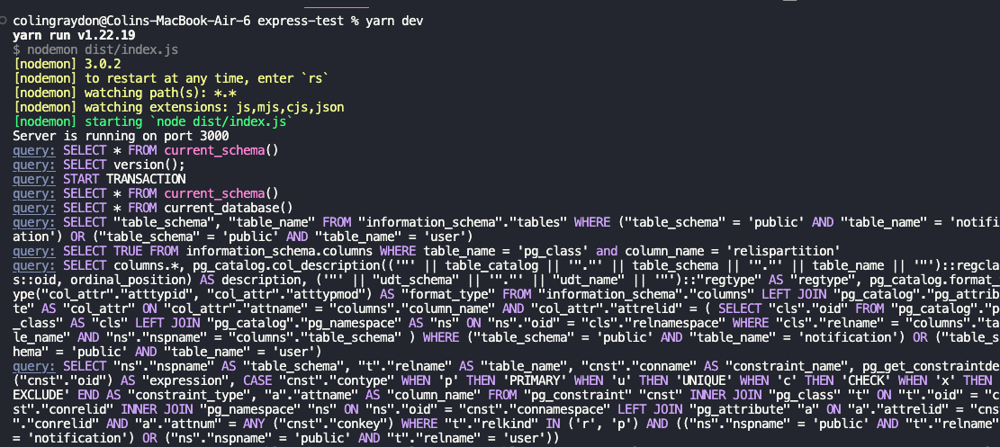

## Database

### Introduction

Databases are typically categorized as SQL or NoSQL.

#### SQL

SQL DBs are relational. They use structured query language, or an ORM (Object Relational Mapping) library to manipulate data. They are typically far more durable and consistent than NoSQL DBs, and every API request is treated atomically. They often scale vertically, and are excellent for data that has well-defined relationships. Common SQL DBs include MySQL, PostgreSQL, SQLite.

Typically, objects will have a one-to-one, one-to-many, many-to-one, or many-to-many relationship with other objects. More on this later.

[Here's a pretty good SQL cheat sheet.](https://www.sqltutorial.org/sql-cheat-sheet/)

#### NoSQL

NoSQL is becoming more and more popular. Typically, NoSQL involves a key-value store, or a document store (like JSON). They can also include graph databases like [Neo4J](https://neo4j.com/) or [AWS's Neptune](https://aws.amazon.com/neptune/), a paid service.

NoSQL is best for unstructured or dynamic data, and is often superior for velocity. They are very easy to scale horizontally as they often contain automatic load balancing across nodes, and are extremely elastic.

Popular databases include [MongoDB](https://www.mongodb.com/), [Firebase](https://firebase.google.com/), a paid service, and [Supabase](https://supabase.com/). Supabase is built on top of PostgreSQL and is an open-source Firebase, essentially.

Memcached and Elasticsearch are important for dev ops stuff, outside of the scope of this course.

[Redis](https://redis.io/docs/get-started/faq/) is extremely important, regardless of what other DB you're using. It is a key value store but it lives in memory, and is typically referred to as a data structure server. If you want your application to be as fast as possible, you're going to need to use Redis or a similar service. Redis supports data caching and session storage, which we'll be talking about, along with a bunch of other features which we won't talk about.

[Here's a good, short video](https://www.youtube.com/watch?v=W2Z7fbCLSTw) about different DB paradigms. It doesn't mention time-series DBs (Prometheus) but it's a good primer.

## Getting Started

This tutorial is going to require a local installation of PostgreSQL on your machine.

[Download here.](https://www.postgresql.org/download/)

Mac users - please use brew to install this. If you do not have brew, [you can get it here.](https://brew.sh/) It's just a package manager for Macs. It's also chip dependent.

Windows users can just follow the installer instructions.

If you're on linux, I'd use apt-get or whatever package manager your distro uses.

When it prompts you, make your username and password "postgres". Make sure port is 5432, the default port.

---

### Creating a DB

`createdb` in the command line will create a database.

`createdb testdatabase` will create a PostgreSQL database called `testdatabase`.

To list all databases, type `psql -l`

To drop the DB (please do this with care) type `dropdb testdatabase`

To connect to a database to run commands, type `psql -d testdatabase`

---

### Creating schemas

A schema is a collection of database objects - tables (specific entities), views (virtual tables from SELECT), and indices (take the database course to learn more).

Before modern tools, we had to create schemas by entering the psql shell and typing something like this

```
CREATE TABLE users (
    user_id SERIAL PRIMARY KEY,
    username VARCHAR(50) NOT NULL,
    email VARCHAR(100) UNIQUE NOT NULL,
    birthdate DATE,
    registration_date TIMESTAMP DEFAULT CURRENT_TIMESTAMP
);
```

I hate it. This course isn't going to cover raw SQL.

We're going to use an ORM - specifically TypeORM, which is used most in industry, although there are many others.

Here's the same exact table, only created with TypeORM.

```
@Entity()
@Unique(['email'])
export class User {
  @PrimaryGeneratedColumn()
  user_id: number;

  @Column({ length: 50, nullable: false })
  username: string;

  @Column({ length: 100, unique: true, nullable: false })
  email: string;

  @Column({ type: 'date', nullable: true })
  birthdate: Date;

  @CreateDateColumn()
  registration_date: Date;
}
```

You can see that this is object-oriented programming. The decorators expose the class and fields to TypeORM, which integrates with your PostgreSQL DB - it also works with other RDBMS as well.

---

### One-to-many, many-to-many


One employee manages one department.

One publisher supplies many books. Conversely, there are many books per one publisher

One book can be in many sections. Likewise, there is one section that holds many books.

Finally, a student has many courses, and each course has many students.

Let's add the ability for a User to make many comments, which are simple strings. We would add the following field to the User schema.

```
@OneToMany(() => Comment, comment => comment.user)
comments: Comment[];
```

We would also need to now create a Comment schema, which has a many-to-one with Users. Here's an example.

```
@Entity()
export class Comment {
  @PrimaryGeneratedColumn()
  comment_id: number;

  @Column({ type: 'text', nullable: false })
  content: string;

  @CreateDateColumn()
  created_at: Date;

  @ManyToOne(() => User, user => user.comments)
  user: User;
}
```

---

### CRUD operations

How do we modify the database? Instead of having to write raw SQL, TypeORM allows us to write much simpler code using their built in functions.

[Read the docs.](https://typeorm.io/)

No one memorizes this stuff, you just have to look at the docs. Generative AI is also pretty good at it.

Simply do a

`npm install typeorm`

to add it to a project.

You'll also need an `npm install pg` if you're working with PostgreSQL.

---

### Data Source

Let's modify our controllers to use some TypeORM functions instead. First, we'll have to create a data source and connect to it in our `index.ts` file. Here's an example `dataSource.ts` file

```
import { DataSource } from "typeorm";
import path from "path";

export const dataSource = new DataSource({
  type: "postgres",
  // host: "127.0.0.1",
  port: 5432,
  host: "postgres",
  // host: "postgres",
  database: "testdb",
  username: "postgres",
  password: "postgres",
  // url: process.env.DATABASE_URL,
  logging: true,
  //creates tables automatically, no need for running a migration
  synchronize: true,
  //running mock migration
  migrations: [path.join(__dirname, "./migrations/*")],
  // entities: [TestEntity1, TestEntity2, etc],
});
```

To initialize the data source, you'll have to write something like this in your index.ts file, before you create your express app.

```
dataSource.initialize()
.then(() => {
    console.log("initialized successfully");
})
.catch((err) => {
    console.log("data source initialization error occurred: ", err);
});
```

---

### Writing TypeORM controllers/resolvers

Let's add TypeORM to some of the controllers we had earlier, so we're modifying a DB instead of a random json file.

First let's make a testdb.

`createdb testdb`

Next, set up your data source and define schemas - make sure they're added as entities to your data source. If everything went right, when you start your server, it should look something like this.



Let's write a controller which returns all users in the database.

```
export const getAllUsers = async (_: Request, res: Response) => {
  const users = await User.find();
  console.log(users);
  if (users.length === 0) {
    return res.status(404).send("No users found");
  }

  return res.status(200).json(users);
};
```

I've included a few more CRUD operations in the `exampleControllers.ts` file, as well as changing some routes. I've included the same repo, but if you checkout the typeorm-controllers branch, you can see a very basic API for a PostgreSQL database, created using TypeORM.

[<span style="font-size:2em;">Here's the repo.</span>](https://github.com/colingraydon/express-test)

---

### Passwords

Never store passwords in plaintext. Ever.

Never transmit passwords in plaintext.

Never serve a website over http which has a user enter a password.

You will be fired on the spot.

Instead, use an encryption library. I like `bcryptjs`. You hash the password (and salt, depending on the library) and you store that instead. Here's a very basic example.

```
const { username, password, email } = req.body;
const hashedPassword = await bcryptjs.hash(password, 10);
// just use hashedPassword from this point out, for registering, login, and changing pw
```

### Authentication Middleware

There are a bunch of ways to do authentication, and we're covering none of them. Essentially, you'll usually have some token, cookie, etc, which is unique and cannot be replicated. This token is issued on login and checked every time a user tries to do something that would require them to be logged in - for example, to delete their notifications.

```
import jwt from 'jsonwebtoken'

const checkJwt = (req, res, next) => {
  // get token from the request headers
  const token = req.header('Authorization');

  if (!token) {
    return res.status(401).json({ error: 'Unauthorized - Token missing' });
  }

  try {
    // verify token
    const decoded = jwt.verify(token, process.env.SECRET_KEY);

    req.user = decoded;

    next();
  } catch (err) {
    return res.status(401).json({ error: 'Unauthorized - Invalid token' });
  }
};

app.get('/protected-route', checkJwt, (req, res) => {
  // If the middleware passes, you can access the user information from req.user
  res.json({ message: 'This is a protected route', user: req.user });
});
```

Typically, a function like this would be stored in a `/middleware` or `/utils` folder. You simply include it as the 2nd parameter in protected routes.

---

### Cascading

When we delete a user, we may want to delete all of their notifications. This is called cascading. Every library/ORM will handle this a bit differently, and writing it in raw SQL is a pain.

If you _don't_ do this, you may be left with garbage data in your database (best case), an exception (bad), or a full on crash for an illegal operation (worst, and most likely). Here's an example of how to write cascading in TypeORM - this is in the `User` class.

```
@OneToMany(() => Notification, (notification) => notification.creatorId, {
  cascade: true,
  onDelete: "CASCADE",
  onUpdate: "CASCADE",
  eager: true,
})
```

If a user is updated or deleted, all of their notifications will first delete or update themselves before the user is changed.

Eager loading means that, when an entity is fetched, all related entries are also fetched. Here, all notifications are fetched on user fetch. Lazy loading means that you only get related entities when accessed for the first time. It may make loading a page faster, but it takes time to load elements on the page. It also means you are making additional queries (expensive), but you can minimize data fetched (cheaper + faster).

If under/overfetching is a concern, just use graphql. If app responsiveness is a concern, just use graphql.

---

## GraphQL

Will cover if we get time.
